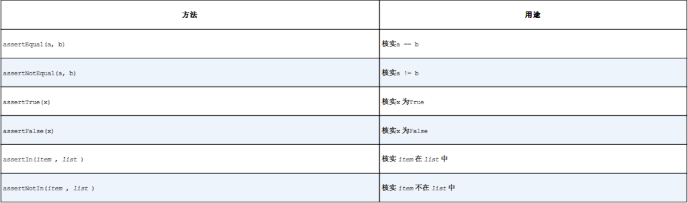

# Python
### 变量和简单类型
* .lower(): 小写  
  .upper(): 大写
* .strip(): 删除左右两端的空白   
  .rstrip():删除右端空白     
  .lstrip():删除左端空白     
* str(value):       
* .append(value):     
  .insert(index,value):  
  del str[index]:删除str数组的第index位置的值       
  .pop(index):根据索引弹出      
  .remove(value):不知道位置，根据值删除      
* .sort():永久性修改元素排列顺序，字母升序，数字升序。reverse=True可设置为降序   
  sorted(value):零时修改排列序号，原列表的顺序不变     
  .reverse():反序       
  len(value):长度       

  * for list in lists：遍历
  * range(start，end，step): 
  * max():      
    min():      
    sum():    
  * str[0:3]:取0、1、2      
    str[-3:]:最后三个  
  * 切片： A=B[:]
  * 元组：str(1，2，3)，str[0],str[1]     
         元组不能修改数据，可以重新赋值        
         不允许str[0]=4，可以str=(5,6,7)    
  * 字典：user={'fname':'w','lname':'jj'}      
    for key,value in user.items()
    user.keys()、user.values()    
  * set(user.values())去除重复值

  * input(value):用户可以输入，提示语为value
  * int(value): 转为整型

### 方法和类
* def  method（value，value2）{}
* def  method (value,value2='a'){}:value2的默认值为a
* def  method（*value）{}:任意数量的value，实参任意
* def  method（**value）{}:任意数量的键值对
* import 类名：导入类
* from 类 import 方法名 ：导入类方法
* from 类 import 方法名 as 别名：给方法取别名
* `class Dog（）{   
        def _init_(self,value1，value2){}
  }
  `
  :`_init_(self,value1，value2)`为构造方法,第一个参数永远是self
* self.value=value :公有
  self._value=value :私有
* `class Car():    
    def __init__(self,name,year):   
        self.name=name    
        self.year=year    
    def getCar(self):   
        print('name is'+self.name+'  year is'+str(self.year))      
    class ElectricCar(Car):   
    def __init__(self,name,year):   
        super().__init__(name,year)   
    def getElectricCar(self):   
        print('ElectricCai name is'+self.name+' year is'+str(self.year))    `
    继承：子类_init_需要实现父类_init_

### 文件与异常
* with open('',type) as file:    
    content=file.read()  :读取文件全部内容
    content=file.readLines(): 按行读取存读列表中

    type: r:读取    
          w:写入    
          a:写入附加到

* try-except捕获：try：   
                 except：    （pass关键字表示什么都不做）
                 else：

* 存储数据    
  json.dump(value,file)   ：写入文件中
  json.load(file) ： 读取到内存

### 测试
* 测试方法：    
  import unittest     
      class Test(unittest.TestCase):     
        def test_first(self):    
          value=needtotestmenthod()   
          self.asssertEqual(value,resultValue)    
      unittest.main()  

  注意方法名要以test_为前缀 
* 各种断言方法
  

* 测试类：    
  