### Spring Security学习笔记
#### 第一章 HelloWorld
1.1. 配置过滤器
为了在项目中使用Spring Security控制权限，首先要在web.xml中配置过滤器，这样我们就可以控制对这个项目的每个请求了

	<!-- spring security -->
	<filter>  
        <filter-name>springSecurityFilterChain</filter-name>  
        <filter-class>org.springframework.web.filter.DelegatingFilterProxy  
        </filter-class>  
    </filter>  
   
    <filter-mapping>  
        <filter-name>springSecurityFilterChain</filter-name>  
        <url-pattern>/*</url-pattern>  
    </filter-mapping>

### security 登陆验证过程
一、首先先讲一下位于所有过滤器最“顶端”的过滤器：
#### **SecurityContextPersistenceFilter**
这个过滤器的功能主要是:在SecurityContextRepository中保存更新一个securityContext，并将securityContext给以后的过滤器使用
先看一下源码：
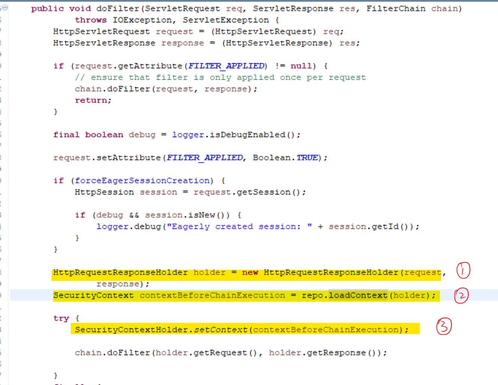
* SecurityContextPersistenceFilter将request和response对象交割HttpRequestResponseHolder维持。
* 然后通过loadContext方法产生SecurityContext实体，该方法在SecurityContextRepository接口中定义，实际实现类为HttpSessionSecurityContextRepository。
* 在这里我们可以看出。SecurityContext实例的创建首先会去调用readSecurityContextFromSession（）方法，该方法为从session中获取SecurityContext实例。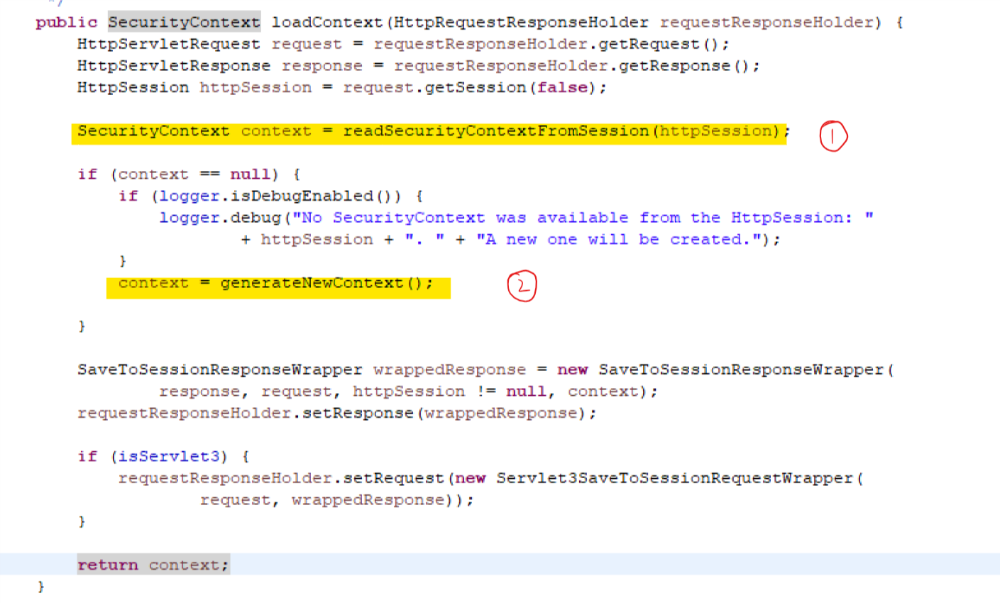
* 判断如果为空则HttpSessionSecurityContextRepository将产生SecurityContext实例的任务交给SecurityContextHolder.createEmptyContext()完成  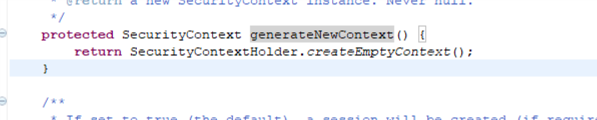
* 当SecurityContext实例化之后，然后再通过调用setContext（）设置到ThreadLocal中
* 调用clearContext（）方法再把SecurityContext实例从SecurityContextHolder中清空
* 最后调用saveContext（）方法将SecurityContext实例持久化到session中  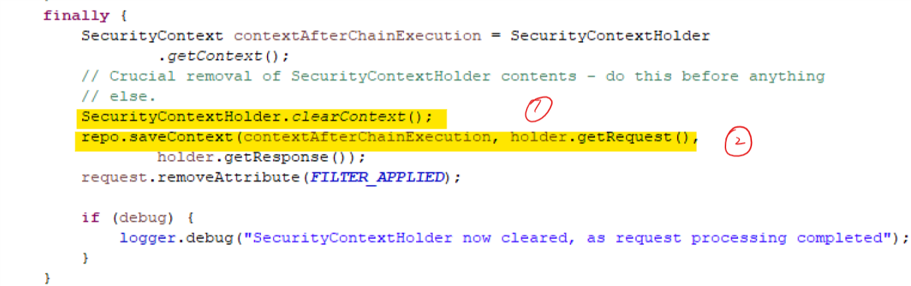

二、讲完SecurityContextPersistenceFilter后，再来讲讲另一个过滤器：
####**UsernamePasswordAuthenticationFilter**
springSecurity的登录验证是由UsernamePasswordAuthenticationFilter这个过滤器来完成的。在该类的父类AbstractAuthenticationProcessingFilter中有一个AuthenticationManager接口属性,验证工作主要是通过这个AuthenticationManager接口的实例来完成的。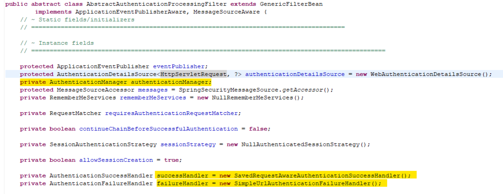
在默认情况下，springSecurity框架会把ProviderManager类的实例注入到该属性.

UsernamePasswordAuthenticationFilter的验证过程如下：
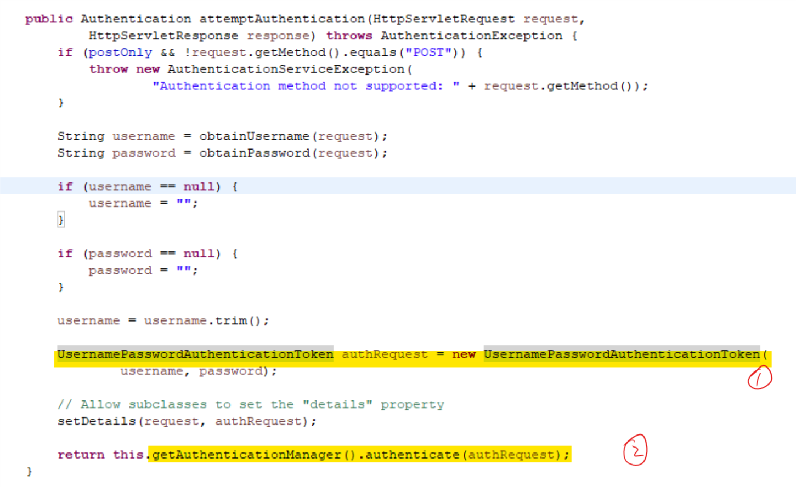

1. 首先过滤器会调用自身的attemptAuthentication方法，从request中取出authentication, authentication是在SecurityContextPersistenceFilter过滤器中通过捕获用户提交的登录表单中的内容生成的一个Authentication接口实例。
这里我们进行详细的分析：
	* 首先attemptAuthentication（）方法将表单请求的信息（用户、密码等信息）赋值给UsernamePasswordAuthenticationToken，可以看出这个构造器默认将认证属性设置为flase。
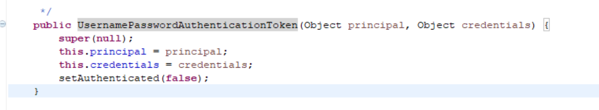	
*  然后调用getAuthenticationManager().authenticate(authRequest)对用户密码的正确性进行验证，认证失败就抛出异常，成功就返回Authentication对象。
		* 深入authenticate（）这个方法我们可以得知，拿到authentication对象后，过滤器会调用ProviderManager类的authenticate方法，并传入该对象.生成的Authentication会被交由AuthenticationManager来进行管理
而AuthenticationManager管理一系列的AuthenticationProvider。
 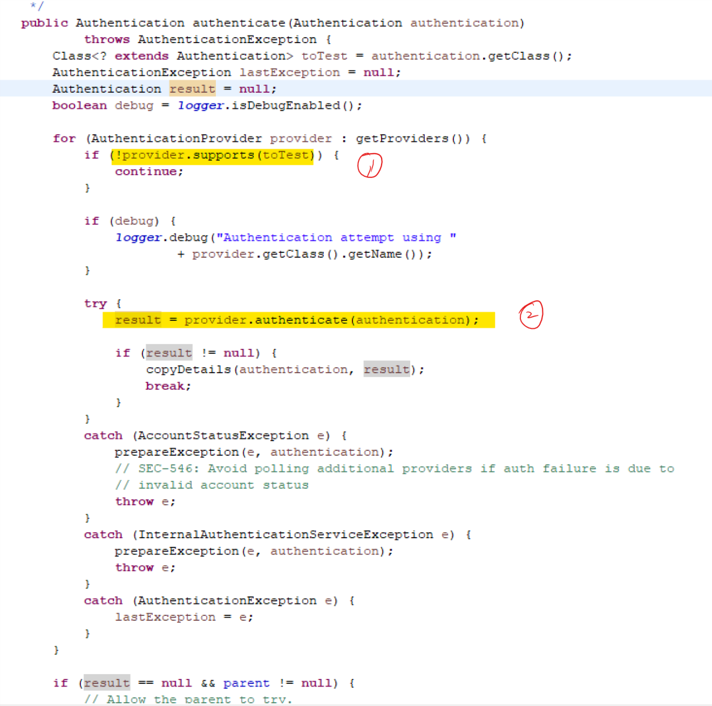
		* ProviderManager类的authenticate方法再调用自身的doAuthentication方法，在doAuthentication方法中会调用类中的List<AuthenticationProvider> providers集合中的各个AuthenticationProvider接口实现类中的authenticate(Authentication authentication)方法进行验证 找到支持的AuthenticationProvider后，在通过调用auhenticate（）方法，在进行更细一步的的Provider对其进行处理。而每一个Provider都会通UserDetailsService和UserDetail来返回一个
以UsernamePasswordAuthenticationToken实现的带用户名和密码以及权限的Authentication。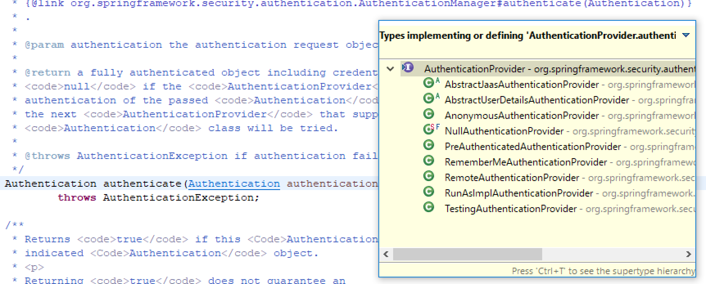
		* 在这里我们对AbstractUserDetailsAuthenticationProvider进行讨论。根据下面源码我们可以看出，首先程序会通过getUserFromCache（）在缓存中查找到与该用户名相匹配的用户的user实体。
		* 如果有，则对密码重新验证；
如果没有，则进行用户的信息验证，执行DaoAuthenticationProvider中的retrieveUser方法，获取一个UserDetails对象。调用retrieveUser（）方法从相关配置（如xml配置文件，数据库）中查询用户信息。这个调用了两个关键的接口，UserDetails和UserDetailsService。如果UserDetails对象为null或者获取时出错就抛出异常UsernameNotFoundException或AuthenticationServiceException异常，
然后一些属性验证之后，对用户密码进行验证。
		* 然后新获取的UserDetails对象放入缓存中
		* 新建一个UsernamePasswordAuthenticationToken一个对象，将authenticated设为true(原来传入的UsernamePasswordAuthenticationToken对象authenticated为false)并返回
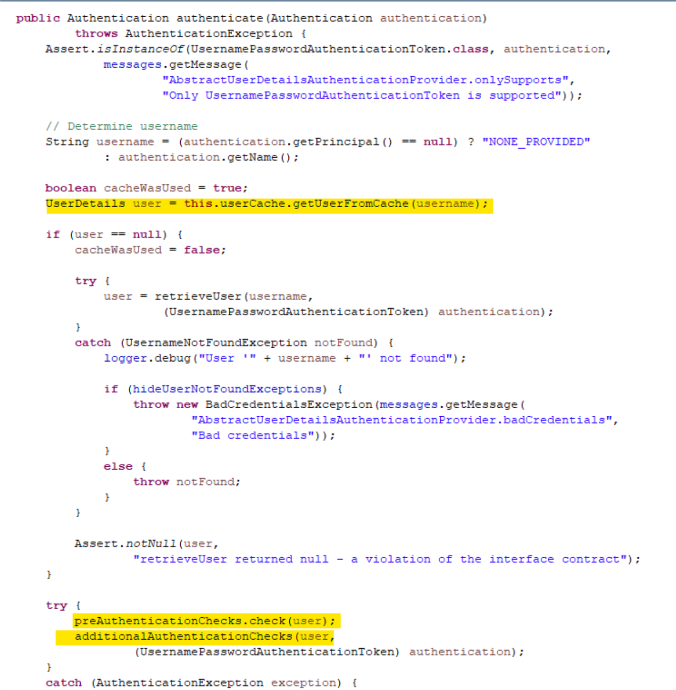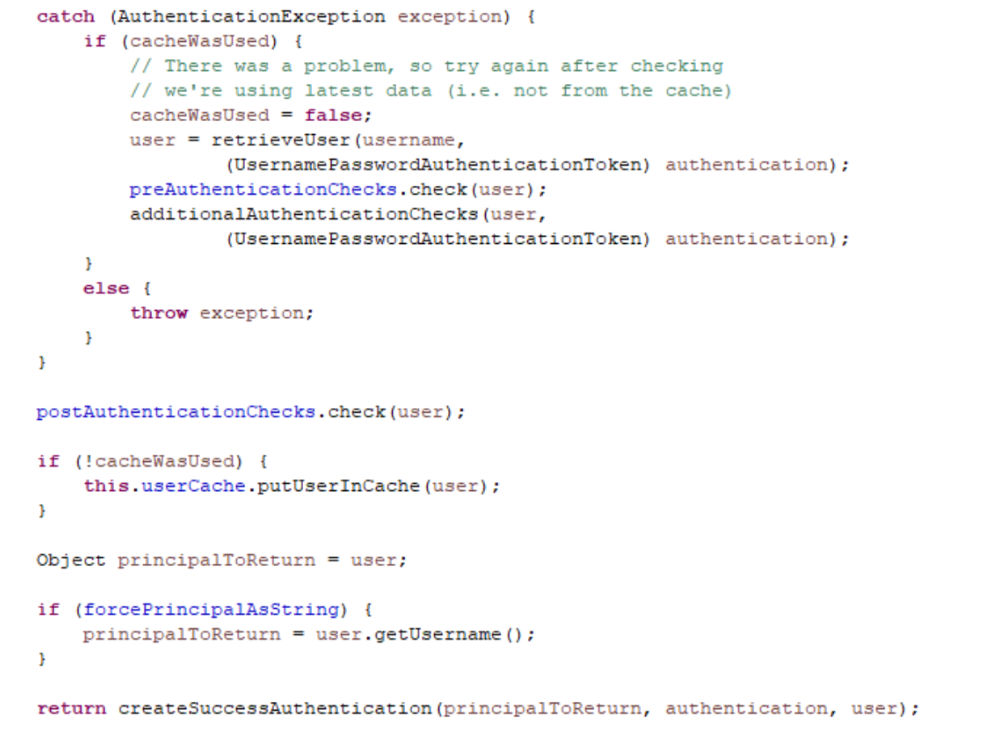

至此整个验证过程就全部结束了。

### spring security使用ajax登陆

由于springsecurity通过默认登陆后，由SimpleUrlAuthenticationSuccessHandler来处理登陆成功后的操作。调用handle（）方法，看下面的源码可知是重定向到指定url。所以当使用ajax进行登陆时，登陆成功后是不存在返回值。那么该如何让springsecurity在验证登陆成功后返回相关参数呢？这个时候我们需要自己定义一个处理登陆成功的handler。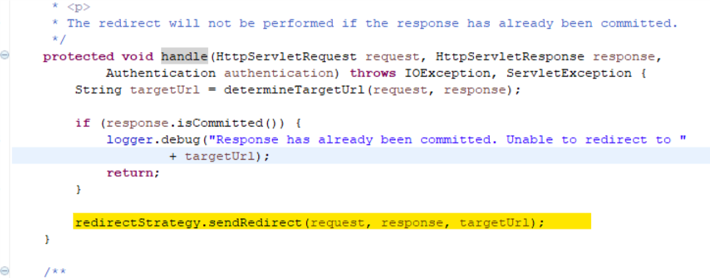

	@Service("authenticationSuccessHandler")
	public class AuthenticationSuccessHandler extends SimpleUrlAuthenticationSuccessHandler implements Serializable{
	private static final long serialVersionUID = -7868794891110645691L;
	@Override
	public void onAuthenticationSuccess(HttpServletRequest request,
			HttpServletResponse response, Authentication authentication)
					throws IOException, ServletException {
		String ajaxHeader = ((HttpServletRequest) request).getHeader("X-Requested-With");
		boolean isAjax = "XMLHttpRequest".equals(ajaxHeader);
		if (isAjax) {
			response.getWriter().print("success");
			response.getWriter().flush();
		} else {
			super.onAuthenticationSuccess(request, response, authentication);
		} 
	}
	}

在xml配置文件中配置

	<form-login login-page="/loginPage" login-processing-url="/login" default-target-url="/logins"
			authentication-failure-url="/loginerror"  
			authentication-success-handler-ref="authenticationSuccessHandler"/>
	<beans:bean id="authenticationSuccessHandler" class="com.security.handler.AuthenticationSuccessHandler">
	</beans:bean>

完成该配置之后就基本上完成了。最后就是写一下ajax
			
		$.ajax({
				url: 'login',
				type: 'post',
				async: true,
				dataType: 'text',
				data:{
					username:username,
					password:password
				},
				success: function(data) {
				},
				error: function(data) {
				}
		})

### springsecurity  盐值加密

按照Spring Security文档的话说：所谓盐值原理其实很简单，就是先将密码和盐值指定的内容合并起来，爱用md5对合并后的内容进行演算。即通过password+"{"+salt+"}"的方式合并起来。如用户名为admin，密码为admin，则存放的密码应该为admin{admin}的md5的值为：ceb4f32325eda6142bd65215f4c0f371
提供一个可以进行md5加密的网站：https://md5jiami.51240.com/

相关配置：
	
	 <password-encoder hash="md5">  
         		<!-- 将每个用户的username作为盐值 -->  
         <salt-source user-property="username"/>  
      </password-encoder>

### Spring Securiy权限标签
先在jsp添加相关标签：
	
	<%@ taglib prefix='sec' uri='http://www.springframework.org/security/tags' %>

然后在对需要进行权限控制的模块加以控制
	
	<sec:authorize access="hasRole('ROLE_ADMIN')">超级管理员</sec:authorize>
	<sec:authorize access="hasRole('ROLE_USER')">用户人员</sec:authorize>

###springsecurity登出
用户登出还是非常的方便的，只需要配置一下就可以完成登出功能。

	<logout logout-url="/logout" logout-success-url="/index" invalidate-session="true" delete-cookies="JSESSIONID"/>

首先是logout-url=“”使用默认登出url就是/logout。logout-success-url=“”的url为登出后跳转的url。

###springsecurity关于登入用户名查不到的异常捕获
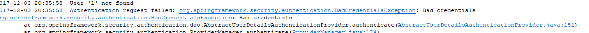
在处理登陆失败的时也同样使用了ajax进行处理。通过重写SimpleUrlAuthenticationFailureHandler类，和之前处理成功类似。但在测试时发现一个问题，如果用户存在密码错误不会出现任何问题，但如果时用户名不存在则会出现异常，报Bad credentials。
通过查看源码我们发现，在AbstractUserDetailsAuthenticationProvider中有这样一段代码：
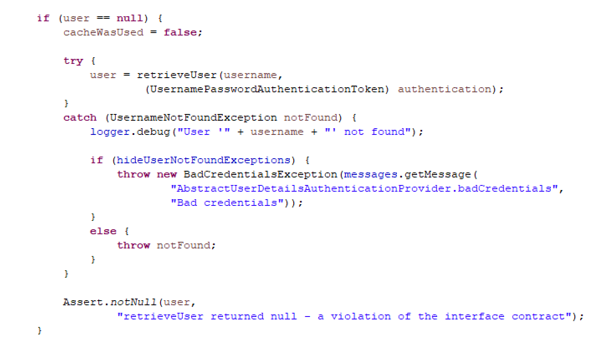
根据相关文档可以知道，hideUserNotFoundExceptions为true的，所以当抛出UsernamenotFoundException,前台只能捕获到Badcredentials的问题。
由于我是通过ajax处理，所以当我要判断是否为UsernamenotFoundException异常时，只需要在重写的SimpleUrlAuthenticationFailureHandler类里判断一下就好，然后返回不同状态即可。
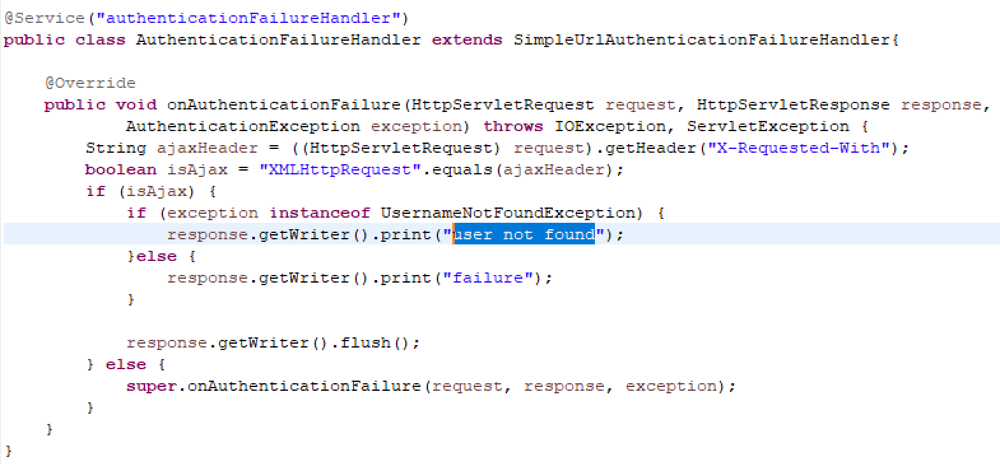
如果不是通过ajax而是通过表单提交通过el表达式获取${session.SPRING_SECURITY_LAST_EXCEPTION.message}值，那么我们就需要将hideUserNotFoundExceptions改为false这样我们就可以获取到UserNotFoundExceptions异常了。
那我们重新配置一下位置文件

		<beans:bean id="authenticationProvider" class="org.springframework.security.authentication.dao.DaoAuthenticationProvider">  
	    <beans:property name="hideUserNotFoundExceptions" value="false" />  
	    <beans:property name="userDetailsService" ref="userDetailsService" />   
	    <beans:property name="passwordEncoder" ref="passwordEncode" />  
	    <beans:property name="saltSource" ref="saltSource" /> 

		<authentication-manager alias="authenticationManager">
		<authentication-provider ref="authenticationProvider">
	<!--  <password-encoder hash="md5">  
         		将每个用户的username作为盐值  
         		<salt-source user-property="username"/>  
		     </password-encoder> -->
		</authentication-provider>
	</authentication-manager>

参考文档：https://www.cnblogs.com/lexiaofei/p/7018405.html?utm_source=itdadao&utm_medium=referral
http://blog.csdn.net/bao19901210/article/details/17558639