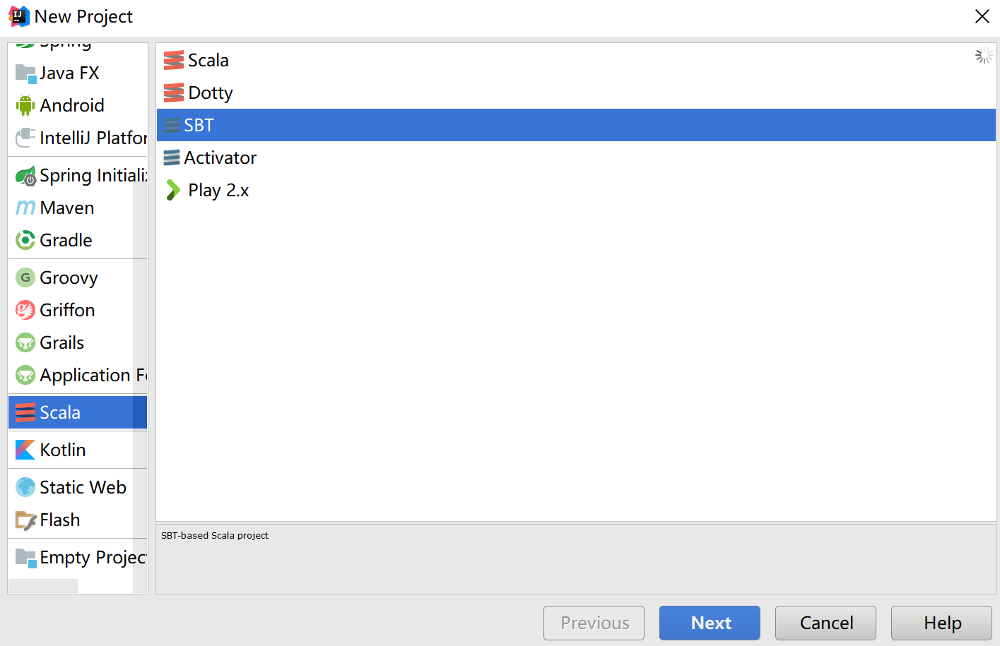

###使用IDEA创建SBT的Scala工程（解决相关依赖问题）
> 由于Spark源码是由Scala语言编写而成，所以在学习Spark的过程中需要接触Scala。目前IDEA对Scala的支持要比Eclipse要好，所以讲一下通过IDEA来创建一个Scala项目。

#### 相关资源下载安装
由于通过IDEA下载相关资源和插件比较慢，在这里把需要的插件都提供出来。
[IDEA+SBT+Scala插件（密码：2p4x）](http://pan.baidu.com/s/1hsD157u)
首先安装好IDEA，然后打开程序，点击Setting

然后选择install plugin from disk，将下载好的Scala插件安装上去。安装成功以后就可以创建Scala工程了。

先等一下创建，我们先将SBT环境搭建好，由于sbt其构建仓库用ivy和maven，之前用过ivy或maven的人都知道，如果不配国内资源镜像，下起来真的要人命。所以在创建Scala之前我们先解决下载依赖库的问题！！！！这个不解决，让IDEA默认设置创建下载真的会让人奔溃。
### 修改IDEA中构建SBT的默认设置
首先，将SBT安装包安装好，我安装在D盘，安装完成后环境变量自动会设置好。然后就打开conf文件夹下的stbconfig配置文件，设置相关参数：
```
-Dsbt.boot.directory=D:\sbt\.sbt\boot
-Dsbt.global.base=D:\sbt\.sbt
-Dsbt.ivy.home=D:\sbt\.ivy2
-Dsbt.repository.config=D:\sbt\conf\repo.properties
-Dsbt.repository.secure=false
```

然后在该目录下新建一个repo.properties，设置国内代理库
```
	[repositories] 
	local
	aliyun-maven: http://maven.aliyun.com/nexus/content/groups/public/
	aliyun-ivy: http://maven.aliyun.com/nexus/content/groups/public/, [organization]/[module]/(scala_[scalaVersion]/)(sbt_[sbtVersion]/)[revision]/[type]s/[artifact](-[classifier]).[ext]
	Nexus osc : https://code.lds.org/nexus/content/groups/main-repo
	Nexus osc thirdparty : https://code.lds.org/nexus/content/groups/plugin-repo/
	typesafe: http://repo.typesafe.com/typesafe/ivy-releases/, [organization]/[module]/(scala_[scalaVersion]/)(sbt_[sbtVersion]/)[revision]/[type]s/[artifact](-[classifier]).[ext], bootOnly  
	typesafe2: http://repo.typesafe.com/typesafe/releases/
	sbt-plugin: http://repo.scala-sbt.org/scalasbt/sbt-plugin-releases/
	sonatype: http://oss.sonatype.org/content/repositories/snapshots  
	uk_maven: http://uk.maven.org/maven2/  
	ibibli: http://mirrors.ibiblio.org/maven2/  
	repo2: http://repo2.maven.org/maven2/
	comp-maven:http://mvnrepository.com/artifact/
	store_cn:http://maven.oschina.net/content/groups/public/
	store_mir:http://mirrors.ibiblio.org/maven2/
	store_0:http://maven.net.cn/content/groups/public/
	store_1:http://repo.typesafe.com/typesafe/ivy-releases/
	store_2:http://repo2.maven.org/maven2/
	sbt-releases-repo: http://repo.typesafe.com/typesafe/ivy-releases/, [organization]/[module]/(scala_[scalaVersion]/)(sbt_[sbtVersion]/)[revision]/[type]s/[artifact](-[classifier]).[ext]
	sbt-plugins-repo: http://repo.scala-sbt.org/scalasbt/sbt-plugin-releases/, [organization]/[module]/(scala_[scalaVersion]/)(sbt_[sbtVersion]/)[revision]/[type]s/[artifact](-[classifier]).[ext]
	maven-central: http://repo1.maven.org/maven2/
```
设置完以后，然后设置IDEA中的配置
点击Setting中的SBT设置JVM Options和Launcher。

在VM parameter中设置相关配置参数
```	
	-Xmx1024M
	-XX:MaxPermSize=512m
	-XX:ReservedCodeCacheSize=256m
	-Dsbt.log.format=true
	-Dsbt.global.base=D:/sbt/.sbt
	-Dsbt.boot.directory=D:/sbt/.sbt/boot/
	-Dsbt.ivy.home=D:/sbt/.ivy2
	-Dsbt.repository.config=D:/sbt/conf/repo.properties
```

然后再选择sbt-launcher.jar。选择之前安装好的sbt目录下的bin目录下的sbt-launcher.jar

这些都安装完成之后。在创建Scala项目时，选择SBT来构建项目。下载相关依赖包时就会变得特别的迅速！！
<font color="red"> ** 但是！！！！！**我原以为这样会变得很快，可真正下载相关jar包时还是会出现各种连接失败，会找不到依赖包的问题，所以在这里我把我下载好的cache放到云盘中，方便以后使用。这样就不用在下载jar包了。</font>
[cache压缩包下载（密码：dj82）](https://pan.baidu.com/s/1c1KfjLQ )
将下载好的cache解压后覆盖D:\sbt\.ivy2目录下的cache，当然我下的sbt版本时13.16。覆盖完以后创建Scala项目IDEA就不用再去下载相关依赖包了，不到一分钟Scala项目就会构建完成。这个时候就可以安安心心的编写第一个HelloWorld！