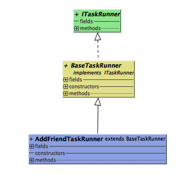

## 机器人相关概念与知识
---
1. ### 养号机器人和普通机器人       
   * 养号机器人：他自己执行相关的任务，这些任务每天都是会自动生成的。   
    执行流程：       
        1. 由SupportAccountScheduleScheduler读取schedule.json配置的任务进行任务分配，生成SupportAccountTaskInfo信息列表
        2. 由SupportAccountTaskScheduler进行任务的创建
        3. 各个任务执行:Scheduler -> TaskRunner -> Scenario -> Action        
   
   
   * 普通机器人：1.根据server端传来的命令，进行相关任务执行   2.根据微信消息触发相关任务 3.根据自身程序设定会执行一些任务

2. ### 机器人需要上报消息
    机器人需要上传相关信息至server，如微信版本信息，机器人软件信息。
3. ### 安装机器人后本地的数据信息
   由于只有在微信的进程中才能访问微信的数据库，所有需要在本地创建数据库表存储微信中的信息（如好友RobotContactInfo，群LocalGroupInfo，账号信息RobotInfo等）。本地表的作用相当一个缓存，例如在进行添加群成员时，我们会先将需要添加的成员加入本地表中，然后与微信数据库中表进行比较，如发现微信数据库表中不存在这些信息，那就进行真正的群操作。 

4. ### 关于TaskTracker
   TaskTracker主要用来对任务的监控，主要通过ThreadLocal存储相关信息显示当前线程状态      
    
    [理解Java中的ThreadLocal](https://droidyue.com/blog/2016/03/13/learning-threadlocal-in-java/)      
   * TaskTracker.create():
   * TaskTracker.start()：
   * TaskTracker.execute()        
   * TaskTracker.finish()     
   * TaskTracker.fail()
   * TaskTracker.retry()     
   * TaskTracker.clearRetry()    
   * TaskTracker.moveQueue()    
   * TaskTracker.delay()        
   * TaskTracker.updateContext()        
   * TaskTracker.failByTriedTimes()
   * TaskTracker.track()

5. ### 关于TaskRunnerWork
    该类主要定义任务线程的一些操作，如start（），stop（），runImmediately（）等
    
    根据类图可以看出类之间的关系。先关注BasePollingWorker这个类。        
    1. 在构造方法中创建一个新的线程，初始化相关变量
    2. start（):启动线程
    3. stop():
    4. runImmediately（）：
    5. runOnce（）：
    6. Runner内部类：

6. ### 关于TaskRunner
    该类主要定义任务需要做的一些步骤        
    

7. ### 关于Xposed
   教程：       
   1. [Xposed从入门到弃坑](https://www.wrbug.com/2017/04/25/Xposed%E4%BB%8E%E5%85%A5%E9%97%A8%E5%88%B0%E5%BC%83%E5%9D%91%EF%BC%9A%E4%B8%80%E3%80%81Xposed%E5%88%9D%E6%8E%A2/)       
   2. [Android Hook框架Xposed原理与源码分析](http://www.360doc.com/content/14/0625/09/9462341_389540723.shtml)

8. ### 关于界面操作需要注意的是
    所有的UI任务都得在forground的队列下执行     
    其次在判断节点的过程中，如发现和原有代码节点判断上不同，使用getUiDevice()进行区分

9. ### 关于不同线程队列的问题
    

## 机器人任务调用
---
* ### 更新机器人信息(包括修改机器人的头像，昵称，性别等等)： UpdateProfileTaskRunner        
* ### 更新好友的备注： EditFriendRemarkTaskRunner     
* ### 接受好友请求：   AcceptFriendRequestTaskRunner      
* ### 接受群邀请：     AcceptJoinGroupRequestTaskRunner       
* ### 收集群聊信息：CollectGroupsTaskRunner    
* ### 添加成员入群（老群接入通过命令）AddToGroupByCommandTaskRunner
    ---
* ### 收集聊天消息（包括各种消息，好友，群，公众号）：CollectChatMessageTaskRunner
    #### 工作整个流程：
    #### 注意事项：
     **1. 只有群聊设置过名称的才能被机器人监控上报信息**  
     
     * _如果是群操作信息_：
        1. 调用类中的processGroupOperationMessage（），该方法会调度一个任务生成，即CollectGroupsTaskRunner。
        2. CollectGroupsTaskRunner 会调用doCollectGroup（）方法进行群信息的收集
        3. doCollectGroup（）方法中会实例化GetGroupInfoScenario，并调用excute（）方法就会进行界面点击操作进入群聊信息界面。
        4. 进行界面操作的过程中并不会上报信息，真正触发上报信息的是HookGroup这个类，当操作进入群聊信息界面后，HookGroup类方法触发调用HandleGroupChangeTaskRunner的notifyGroupChange（）方法

    * _如果是群成员变化_：      
        * 在processGroupOperationMessage（）方法中判断，如果是群成员变化，直接调用HandleGroupChangeTaskRunner的notifyGroupChange（）方法。
    
    * 

    ---
* ### 上报机器人信息：UploadRobotInfoTaskRunner 
    ---    
    1. 获取机器人的基本信息
    2. 收集机器人的二维码
    3. 收集机器人的balace？ 进入的是钱包界面 -> GetRobotBalanceScenario

##  新合作方流程 
  1. 新建合作方，给合作方分配一个虚拟主角
        * #### 虚拟主角概念：
            可以看成为这个合作方的微信号 ？
        * #### 虚拟主角作用：?
  2. 创建一个该合作方的主群，名称叫A，设置虚拟主角和小管家。
    
        * #### 创建完成一共会生成两个群：         
            * 名称为A的并不是一个实际的群       
            * 名称为A1群才是小管家创的群
        * #### 主群的概念：
            * 群限制500，
            
        * #### 主群的作用：

 3. 进行老群接入：        

    选中一个主群，关联几个子群。
    *  业务流程：

        * A主群设置的虚拟主角新建一个群名称也叫子群名称，然后虚拟主角拉子群的小管家到该群

        * 小管家入群后，虚拟主角将群主转给小管家，小管家去拉子群中的小助手

